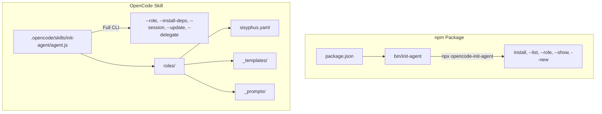

<p align="center">
  
  
  
  =14">
</p>

<h1 align="center">🧠 init-agent</h1>
<p align="center"><strong>One command to initialize your AI assistant.</strong><br>
Auto-install skills, MCP servers, and plugins — configured by role, ready in seconds.</p>

<p align="center">
  <i>让你的 AI 助手开箱即用。一条命令，加载角色、安装依赖、配置模型。</i>
</p>

---

## 🎯 The Problem

Every time you start a new coding session with an AI, you repeat the same ritual:

```bash
# Manual setup, every single time:
# →  manually load skills
# →  remember which MCP servers you need
# →  hunt down the right prompt template
# →  configure model settings
# →  install the right plugins
```

**Different tasks need different setups:**
- Code review needs security analysis tools
- Frontend work needs visual testing
- Architecture planning needs deep reasoning

This is repetitive, error-prone, and wastes context.

## ⚡ The Solution: One Command

```bash
# Initialize your AI for architecture work:
/init-agent --role sisyphus
```

That's it. One command, and your AI is fully configured:

```
# "I need to review this PR"     →  /init-agent --role reviewer
# "Let's build a feature"        →  /init-agent --role developer
# "Pair program with me"         →  /init-agent --role collaborator
```

Each role **auto-installs** the right skills, MCP servers, and plugins — and writes a ready-to-use configuration file.

---

## 🚀 Quick Start

### Install

```bash
# As an OpenCode skill (recommended):
npx opencode-init-agent install

# Or in any project directory:
cd your-project
npx opencode-init-agent install
```

### Use

```bash
# See available roles:
/init-agent --list
# → sisyphus, developer, reviewer, collaborator

# Load a role — auto-installs everything:
/init-agent --role sisyphus

# The output:
#   [step] Auto-installing dependencies for role 'sisyphus'...
#   [info] Skills to load (9): brainstorming, writing-plans, ...
#   [info] MCP servers to configure (2): playwright, context7
#   [success] Plugin: rtk — installed
#   [success] Agent configuration saved to sisyphus.config.md
```

### What `--role` Does

| Action | Output |
|--------|--------|
| 🧠 Formats role prompt | Full agent identity with personality, rules, capabilities |
| 📦 Lists required skills | `task(load_skills=["brainstorming", "writing-plans", ...])` |
| 🔌 Configures MCP servers | playwright, context7, etc. |
| ⚙️ Installs CLI plugins | rtk, node, git — auto-detected if present |
| 📝 Writes config file | `sisyphus.config.md` with all settings |

---

## 🎭 Pre-Configured Roles

| Role | Purpose | Skills | MCPs | Plugins |
|------|---------|--------|------|---------|
| **sisyphus** 🏛️ | Orchestrator — delegate, parallelize, verify | 9 | playwright, context7 | rtk, node, git, docker, python3, curl |
| **developer** 💻 | Build features — TDD, clean code | 5 | — | — |
| **reviewer** 🔍 | Code review — security, quality | 4 | playwright, context7 | — |
| **collaborator** 🤝 | Pair programming — brainstorming, debugging | 3 | — | — |

### Skill Layering (core → standard → all)

Each role has three tiers of dependencies, so you only load what you need:

```yaml
# From sisyphus.yaml — the orchestrator role:
requires:
  skills:
    core: [brainstorming, writing-plans]          # ✓ Always loaded
    standard: [subagent-driven, verification]      # ✓ Most tasks
    all: [systematic-debugging, tdd, review-work]  # ✓ Full workflow
  mcp:
    core:
      - name: playwright    # Browser automation for UI verification
    standard:
      - name: context7      # Documentation & OSS reference search
  plugins:
    core: [rtk, node, git]  # Always available
    standard: [docker]
    all: [python3, curl]
```

---

## 🏗 Architecture

### Dual Layout



**Two `agent.js` files, different purposes:**
- `bin/init-agent` (~410 lines) — npm-published, zero dependencies, lightweight install/listing
- `.opencode/skills/init-agent/agent.js` (~1100 lines) — full-featured, js-yaml, all commands

### Self-Evolution

The system can **introspect and update itself**:

```bash
# See auto-generated subagent config for any role:
/init-agent --session developer

# Persist auto-generated definitions into the YAML file:
/init-agent --update sisyphus
```

New subagents are automatically discovered and merged into existing roles — no manual YAML editing required.

### Delegation Templates

Generate production-ready prompts for sub-agents:

```bash
# Generate a delegation prompt for deep implementation:
/init-agent --delegate deep "Implement user authentication with JWT"

# Generate a delegation prompt for codebase exploration:
/init-agent --delegate explore "Find auth middleware patterns"
```

---

## 📋 All Commands

```bash
# Role Management
/init-agent --list                          # List all roles
/init-agent --role <name>                   # Load role + auto-install deps
/init-agent --show <name>                   # Display role YAML
/init-agent --new <name>                    # Create role (smart analysis)

# Dependency Management
/init-agent --install-deps <name>           # Install skills, MCPs, plugins

# Session & Evolution
/init-agent --session [role]                # Session snapshot with auto-config
/init-agent --update [role]                 # Save auto-definitions to YAML

# Delegation
/init-agent --agents                        # List available sub-agents
/init-agent --delegate <agent> <scenario>   # Generate delegation prompt

# Installation
npx opencode-init-agent install             # Install as OpenCode skill
```

---

## 🎨 Creating Custom Roles

```bash
# Smart creation — detects role type from name:
/init-agent --new security-auditor
# → Detected: Security Researcher
# → Generates role with appropriate traits and capabilities

# Interactive mode — full control:
/init-agent --new my-role --interactive
# → Prompts for title, traits, capabilities
```

### Auto-Injected Behavioral Guidelines

When creating a new role, the system automatically appends behavioral guidelines (from [Andrej Karpathy's CLAUDE.md](https://github.com/multica-ai/andrej-karpathy-skills)) to the project's `AGENTS.md`. Four principles: **Think Before Coding, Simplicity First, Surgical Changes, Goal-Driven Execution**.

```bash
/init-agent --new my-role
# [success] Role 'my-role' created at roles/my-role.yaml
# [success] Behavioral guidelines appended to AGENTS.md

# Subsequent creations skip duplicates automatically:
/init-agent --new another-role
# [info] Behavioral guidelines already present in AGENTS.md, skipping.
```

Or write a YAML file directly using the templates:

```bash
# Start from the developer template
cp .opencode/skills/init-agent/roles/_templates/developer.yaml my-role.yaml
# Edit to match your needs
```

---

## 🔧 How Dependency Installation Works

| Dependency Type | Install Strategy | Example |
|----------------|-----------------|---------|
| **Skills** | Printed as `task(load_skills=[...])` | Requires OpenCode runtime |
| **MCP Servers** | Listed with descriptions | Requires OpenCode configuration |
| **npm Plugins** | `npm install -g <name>` | rtk |
| **System Tools** | Detected via `which`, skipped if absent | docker, python3, curl |

```bash
$ /init-agent --install-deps sisyphus
[step] Installing dependencies for role 'sisyphus'...
[info] Skills to load: 9
  skill: brainstorming — use task(load_skills=["brainstorming"], ...)
  skill: writing-plans — use task(load_skills=["writing-plans"], ...)
  ...
[info] Plugins to install: 6
  plugin: rtk — installed
  plugin: node — installed
  plugin: docker — manual install required (e.g. apt install docker)
```

---

## 🤝 Superpowers Integration

init-agent works with [Superpowers](https://github.com/obra/superpowers) to form a complete **WHO + HOW** workflow:

| Skill | Role |
|-------|------|
| **init-agent** | **WHO** — defines agent personality, capabilities, role |
| **superpowers** | **HOW** — provides workflow: brainstorm → plan → execute → verify |

```bash
# Full workflow:
/init-agent --role sisyphus     # Set WHO you are
# → Sisyphus then uses superpowers skills:
# → brainstorming, writing-plans, subagent-driven, verification
```

---

## 📄 License & Links

- **Repository**: [github.com/fifaliao/smartAgent](https://github.com/fifaliao/smartAgent)
- **npm**: `npx opencode-init-agent`
- **License**: MIT

---

<p align="center">
  <b>One command. Full setup. Zero repetition.</b><br>
  <i>给你的 AI 一个开箱即用的角色初始化方案。</i>
</p>
