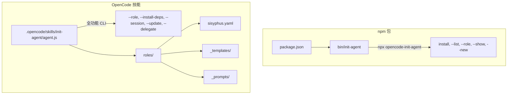

<p align="center">
  
  
  
  =14">
</p>

<h1 align="center">🧠 init-agent</h1>
<p align="center"><strong>一条命令，让你的 AI 助手开箱即用。</strong><br>
根据角色自动安装技能、MCP 服务器和插件 —— 秒级配置，即用即得。</p>

<p align="center">
  <i>One command to initialize your AI assistant. English version available at <a href="README.en.md">README.en.md</a></i>
</p>

---

## 🎯 痛点

每次启动新的 AI 编程会话，你都要重复以下繁琐操作：

```bash
# 每次都要手动执行：
# → 手动加载技能
# → 记住需要哪些 MCP 服务器
# → 查找正确的 prompt 模板
# → 配置模型设置
# → 安装所需的插件
```

**不同任务需要不同的配置：**
- 代码审查需要安全分析工具
- 前端工作需要视觉测试
- 架构规划需要深度推理能力

这种重复性操作不仅浪费时间，还容易出错，消耗宝贵的上下文。

## ⚡ 解决方案：一条命令搞定

```bash
# 为你的架构工作初始化 AI 助手：
/init-agent --role sisyphus
```

就这么简单。一条命令，AI 助手即刻配置完毕：

```
# "我需要审查这个 PR"     →  /init-agent --role reviewer
# "让我们实现一个功能"    →  /init-agent --role developer
# "和我一起结对编程"      →  /init-agent --role collaborator
```

每个角色都会**自动安装**所需的技能、MCP 服务器和插件，并生成即用型配置文件。

---

## 🚀 快速开始

### 安装

```bash
# 作为 OpenCode 技能安装（推荐）：
npx opencode-init-agent install

# 或在任何项目目录中：
cd your-project
npx opencode-init-agent install
```

### 使用

```bash
# 查看所有可用角色：
/init-agent --list
# → sisyphus, developer, reviewer, collaborator

# 加载角色 —— 自动安装所有依赖：
/init-agent --role sisyphus

# 输出示例：
#   [step] 正在为角色 'sisyphus' 自动安装依赖...
#   [info] 需要加载的技能 (9): brainstorming, writing-plans, ...
#   [info] 需要配置的 MCP 服务器 (2): playwright, context7
#   [success] 插件：rtk — 已安装
#   [success] 代理配置已保存到 sisyphus.config.md
```

### `--role` 命令做了什么

| 操作 | 输出结果 |
|------|---------|
| 🧠 格式化角色提示词 | 完整的代理身份，包含个性、规则、能力 |
| 📦 列出所需技能 | `task(load_skills=["brainstorming", "writing-plans", ...])` |
| 🔌 配置 MCP 服务器 | playwright, context7 等 |
| ⚙️ 安装 CLI 插件 | rtk, node, git —— 自动检测是否已安装 |
| 📝 写入配置文件 | 包含所有设置的 `sisyphus.config.md` |

---

## 🎭 预配置角色

| 角色 | 用途 | 技能数 | MCPs | 插件 |
|------|------|--------|------|------|
| **sisyphus** 🏛️ | 协调者 —— 委托、并行执行、验证 | 9 | playwright, context7 | rtk, node, git, docker, python3, curl |
| **developer** 💻 | 实现功能 —— TDD、整洁代码 | 5 | — | — |
| **reviewer** 🔍 | 代码审查 —— 安全、质量 | 4 | playwright, context7 | — |
| **collaborator** 🤝 | 结对编程 —— 头脑风暴、调试 | 3 | — | — |

### 技能分层（core → standard → all）

每个角色都有三层依赖，按需加载：

```yaml
# 来自 sisyphus.yaml —— 协调者角色：
requires:
  skills:
    core: [brainstorming, writing-plans]          # ✓ 始终加载
    standard: [subagent-driven, verification]      # ✓ 大多数任务
    all: [systematic-debugging, tdd, review-work]  # ✓ 完整工作流
  mcp:
    core:
      - name: playwright    # 用于 UI 验证的浏览器自动化
    standard:
      - name: context7      # 文档和开源参考搜索
  plugins:
    core: [rtk, node, git]  # 始终可用
    standard: [docker]
    all: [python3, curl]
```

---

## 🏗 架构设计

### 双重布局



**两个 `agent.js` 文件，不同用途：**
- `bin/init-agent`（约 410 行）—— npm 发布版，零依赖，轻量级安装/列表功能
- `.opencode/skills/init-agent/agent.js`（约 1100 行）—— 全功能版，js-yaml，支持所有命令

### 自我进化机制

系统能够**自我觉察并更新**：

```bash
# 查看任何角色的自动生成子代理配置：
/init-agent --session developer

# 将自动生成的定义持久化到 YAML 文件：
/init-agent --update sisyphus
```

新子代理会被自动发现并合并到现有角色中 —— 无需手动编辑 YAML。

### 委托模板

为子代理生成生产级 prompt：

```bash
# 为深度实现生成委托 prompt：
/init-agent --delegate deep "使用 JWT 实现用户认证"

# 为代码库探索生成委托 prompt：
/init-agent --delegate explore "查找认证中间件模式"
```

---

## 📋 所有命令

```bash
# 角色管理
/init-agent --list                          # 列出所有角色
/init-agent --role <name>                   # 加载角色 + 自动安装依赖
/init-agent --show <name>                   # 显示角色 YAML 定义
/init-agent --new <name>                    # 创建角色（智能分析）

# 依赖管理
/init-agent --install-deps <name>           # 安装技能、MCPs、插件

# 会话与进化
/init-agent --session [role]                # 会话快照，含自动生成配置
/init-agent --update [role]                 # 保存自动生成定义到 YAML

# 委托
/init-agent --agents                        # 列出可用子代理
/init-agent --delegate <agent> <scenario>   # 生成委托 prompt

# 安装
npx opencode-init-agent install             # 作为 OpenCode 技能安装
```

---

## 🎨 创建自定义角色

```bash
# 智能创建 —— 从名称检测角色类型：
/init-agent --new security-auditor
# → 检测到：安全研究员
# → 生成具有适当特质和能力的角色

# 交互模式 —— 完全控制：
/init-agent --new my-role --interactive
# → 提示输入标题、特质、能力
```

### 自动注入行为准则

创建新角色时，系统会自动将行为准则（源自 [Andrej Karpathy 的 CLAUDE.md](https://github.com/multica-ai/andrej-karpathy-skills)）追加到项目根目录的 `AGENTS.md`，包含四大准则：**先思考再编码、简洁优先、手术式修改、目标驱动执行**。

```bash
/init-agent --new my-role
# [success] Role 'my-role' created at roles/my-role.yaml
# [success] Behavioral guidelines appended to AGENTS.md

# 再次创建不会重复追加（自动去重）：
/init-agent --new another-role
# [info] Behavioral guidelines already present in AGENTS.md, skipping.
```

或直接使用模板编写 YAML 文件：

```bash
# 从 developer 模板开始
cp .opencode/skills/init-agent/roles/_templates/developer.yaml my-role.yaml
# 编辑以满足你的需求
```

---

## 🔧 依赖安装机制

| 依赖类型 | 安装策略 | 示例 |
|---------|---------|------|
| **技能** | 输出为 `task(load_skills=[...])` | 需要 OpenCode 运行时 |
| **MCP 服务器** | 列出描述 | 需要 OpenCode 配置 |
| **npm 插件** | `npm install -g <name>` | rtk |
| **系统工具** | 通过 `which` 检测，缺失则跳过 | docker, python3, curl |

```bash
$ /init-agent --install-deps sisyphus
[step] 正在为角色 'sisyphus' 安装依赖...
[info] 需要加载的技能：9
  skill: brainstorming — 使用 task(load_skills=["brainstorming"], ...)
  skill: writing-plans — 使用 task(load_skills=["writing-plans"], ...)
  ...
[info] 需要安装的插件：6
  plugin: rtk — 已安装
  plugin: node — 已安装
  plugin: docker — 需要手动安装（如 apt install docker）
```

---

## 🤝 Superpowers 集成

init-agent 与 [Superpowers](https://github.com/obra/superpowers) 配合使用，形成完整的 **WHO + HOW** 工作流：

| 技能 | 角色 |
|------|------|
| **init-agent** | **WHO** —— 定义代理个性、能力、角色 |
| **superpowers** | **HOW** —— 提供工作流：头脑风暴 → 规划 → 执行 → 验证 |

```bash
# 完整工作流：
/init-agent --role sisyphus     # 设定你是谁
# → Sisyphus 随后使用 superpowers 技能：
# → brainstorming, writing-plans, subagent-driven, verification
```

---

## 📄 许可证与链接

- **仓库**: [github.com/fifaliao/smartAgent](https://github.com/fifaliao/smartAgent)
- **npm**: `npx opencode-init-agent`
- **许可证**: MIT
- **英文版本**: [README.en.md](README.en.md)

---

<p align="center">
  <b>一条命令。完整配置。零重复。</b><br>
  <i>给你的 AI 助手一个开箱即用的角色初始化方案。</i>
</p>